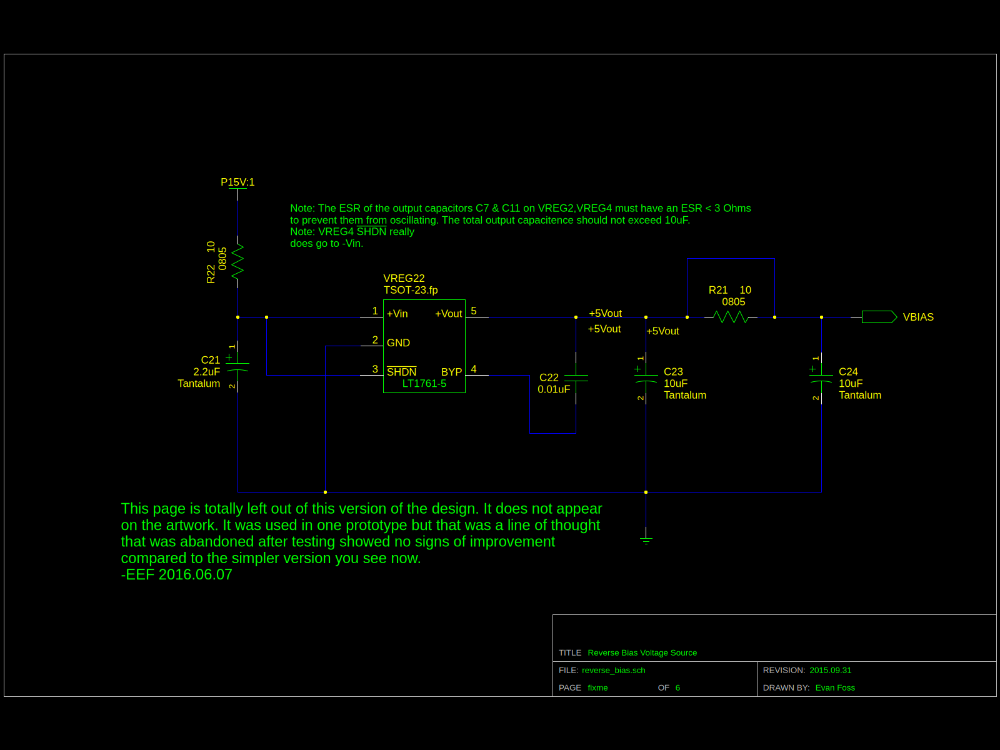

# EPL FiberAmp

## Description

This device was used with an optical sensor to measure sound pressure levels in space constrained environments. The That end was the sensor the other end of the fiberoptic line was attached to a splitter connecting to two more lines that went to the output and input of this device. The FiberAmp supplies a low noise light source to illuminate down the fiber and a photodiode with matching high gain transimpedance amplifier with AC and DC coupled outputs. The AC coupled output was for making measurements of the sound. The DC output was used for verifying the delicate gold coating was not damaged and that light is still reflecting off of it.

Note: Those of you more aware of physics might want to skip to the section at the end titled "Future".

## Development

Most frequently along the auditory path of cadaver ears. The sensor was a fiberoptic line with a thin gold coating deposited onto it's end viaan evaporation process. The original concept was proved by Lisa Olsen's team earlier. The electronics for this were however started with a clean sheet by Evan Foss. The reasoning was simple, the original design and a revised update from EPL earlier were very old and both had seen numerous itterations that added amplifier stages haphazardly. There was also the issue of stability. The earlier EPL update was about 15 years old at least and it was known for periodically becoming unstable and self oscillating for unknown reasons.

### Alternate Versions and Experiments

Part way into the process the project was canceled, later it was uncanceled. This happened a few times. Along the way other features were requested and canceled.

|Feature or Concept         | Designed                  | Tested                | Observations
|:---------------           |:---------------           |:---------------       |:---------------
|Infrasound Measurement     | Yes                       | No                    | The 1/f noise etc of the amplifiers made this notion crazy once more there was serious doubt from the team making the sensors that they were responding at that scale
|Reverse Bias on photodiode | Yes                       | Yes                   | This had no obvious effect on THD+N and was abandoned
|Alternatives for 1st stage opamp| Yes                  | No                    | I had drawn up early versions with a few alternative opamps for that first stage because it was unclear on paper which would perform better

## Toolchain

The development toolchain was as follows:

|Tool Name                                                                                   | License           | Function
|:---------------                                                                            | :-------------    | :-----------------
|<a href="https://www.sagemath.org//">SageMath</a>                                           | Open Source       | Online Mathematics Software
|<a href="https://github.com/lepton-eda/lepton-eda">lepton-eda</a>                           | Open Source       | EDA (Electronic Design Automation) suite lepton-eda a fork of gEDA
|<a href="https://ngspice.sourceforge.io/">ng-spice</a>                                      | Open Source       | Circuit Simulator
|<a href="http://repo.hu/projects/pcb-rnd/">pcb-rnd</a>                                      | Open Source       | CAD (Computer Aided Design) tool for PCB (Printed Circuit Board) layout gEDA/PCB
|<a href="https://gerbv.github.io/">gerbv</a>                                                | Open Source       | Gerber viewer
|<a href="https://www.gnu.org/software/make/">GNU/Make</a>                                   | Open Source       | Toolchain automation
|<a href="https://www.frontpanelexpress.com/front-panel-designer">Front Panel Designer</a>   | Free as in Beer   | Front Panels Express Software

Sadly all my SageMath entries for this project appear lost. I believe a SageMath server refresh some years ago took them out. 

A partial simulation of the device was created to see how the integrators would behave. It is in the "simulation" directory. I had intended I think to add more to simulate the reverse bias and other ideas but there is so much about the sensor that would need to be characterized for that. All that measurement would basically be just as time consuming and expensive as building a few versions and testing them which was contentious with this projects PI.

## Circuit Design

|
|:-----------------
|Sch1: led.sch

|
|:-----------------
|Sch2: transimpedance.sch

|
|:-----------------
|Sch1: cover.sch

|
|:-----------------
|Sch1: cabledrive.sch

|
|:-----------------
|Sch1: reverse_bias.sch

### Grounding

## PCB Layouts

## Packaging and Construction

The device was designed to fit in the standard subrack enclosure with the following front panel. The limited space on the front panel meant there was no room for an on/off switch unfortunately. 

|
|:-----------------
|Pic1: Image of the front of the completed device sitting on it's side.

## Future

### A word about physics

At the time the device was designed it was assumed by everyone that the operating principle was this:
Light shines down the fiber, bounces off the coating, and sound pushing on the coating causes AM modulation of the returning light.

The more I worked on the fiberamp the more apparent it became that this was not the case. The actual effect happening is a laser dopplar vibrometer. Meaning the device was not AM modulating at all but the self interferance of the light coming back off the coating was creating the effect. This explains why the earlier designs worked as well as they did, the added stages with haphazard gains caused distortion that was unintentionally making a demodulating effect.

This also explains why a large number of the optical assemblies made were never working. The length of the fiberoptic cables has to be matched to within fractions of a wavelength. The team was attributing this to issues in the coating process and had spent years refining that process not realizing the coating was likely fine. I believe this modulated waveform might also be the source of the "self oscillation" that the users were seeing in the earlier EPL revision of the device.

All future work on this device should really be around:
1. Changing to a single light source with integrated photodiode so the optical splitter is removed
2. Altering the optics to just be a coated fiber without the added splitter and it's two cables
3. Retailoring the transimpedance source to the bandwidth required for an LDV frontend
4. Using a more cohearant source of light
5. Adopting the grounding plan I introduced in the BioAmp where the devices in the subrack only use an RC bridge between analog common and chassis instead of the short between them currently in use.
6. An on/off switch so the user can swap sensors without turning the subrack power on and off.

Of these goals I believe 1, 2, 3, 5, and 6 are easily possible with minor modifications but 4 might be an issue. The problem I have is that a lot of fiber coupled LED/Photodiode pairs I find are not clear on if the part is using a laser diode or just an LED. I suspect many of the LEDs are actually "cohearent enough" for our purposes.

All this said after I left EPL it is my understanding that they switched to a commercially made device. So all this is just being documented for future refrence.

### A minor note about tools

The PCB layout for the device required a number of features including removing soldermask from around some traces that was at the time not a feature of the PCB design software (gEDA/PCB now defunct). This and other features are now standard in PCB-RND and much easier to use. So migration there would be an advantage. 

