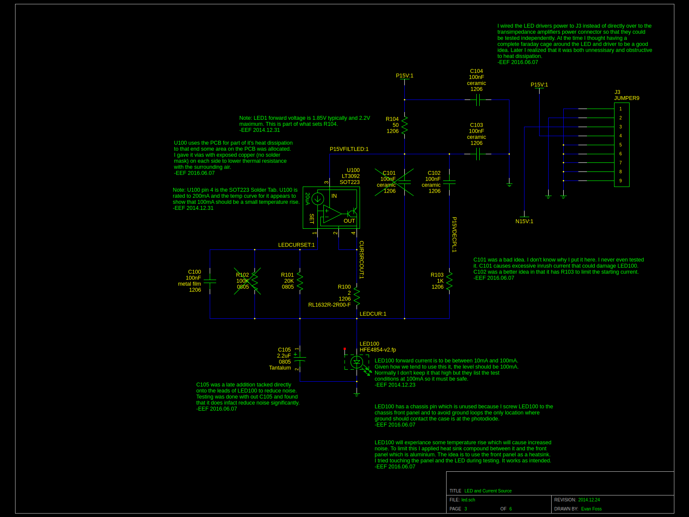
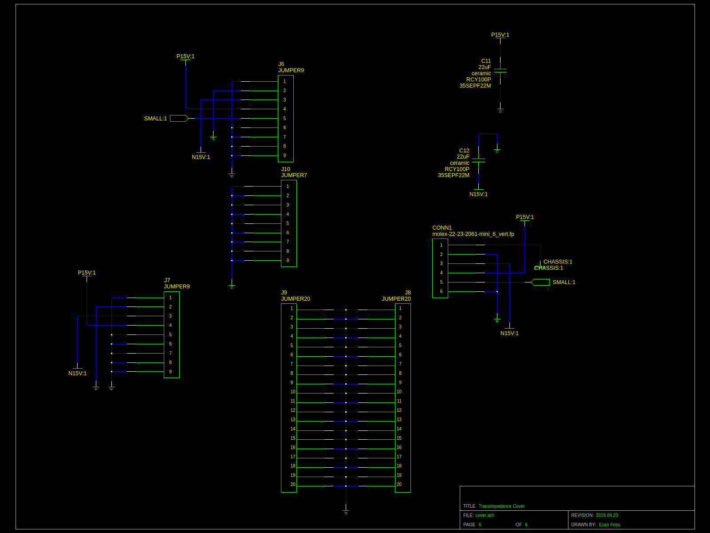

# EPL FiberAmp

## Description

This device was used with an optical sensor to measure sound pressure levels in space constrained environments. The That end was the sensor the other end of the fiberoptic line was attached to a splitter connecting to two more lines that went to the output and input of this device. The FiberAmp supplies a low noise light source to illuminate down the fiber and a photodiode with matching high gain transimpedance amplifier with AC and DC coupled outputs. The AC coupled output was for making measurements of the sound. The DC output was used for verifying the delicate gold coating was not damaged and that light is still reflecting off of it.

Note: Those of you more aware of physics might want to skip to the section at the end titled "Future".

## Development

Most frequently along the auditory path of cadaver ears. The sensor was a fiberoptic line with a thin gold coating deposited onto it's end viaan evaporation process. The original concept was proved by Lisa Olsen's team earlier. The electronics for this were however started with a clean sheet by Evan Foss and the DC filter network from the earlier EPL revision by Ishmael S. W. The reasoning was simple, the original design and a revised update from EPL earlier were very old and both had seen numerous itterations that added amplifier stages haphazardly. There was also the issue of stability. The earlier EPL update was about 15 years old at least and it was known for periodically becoming unstable and self oscillating for unknown reasons.

### Alternate Versions and Experiments

Part way into the process the project was canceled, later it was uncanceled. This happened a few times. Along the way other features were requested and canceled.

|Feature or Concept         | Designed                  | Tested                | Observations
|:---------------           |:---------------           |:---------------       |:---------------
|Infrasound Measurement     | Yes                       | No                    | The 1/f noise etc of the amplifiers made this notion crazy once more there was serious doubt from the team making the sensors that they were responding at that scale
|Reverse Bias on photodiode | Yes                       | Yes                   | This had no obvious effect on THD+N and was abandoned
|Alternatives for 1st stage opamp| Yes                  | No                    | I had drawn up early versions with a few alternative opamps for that first stage because it was unclear on paper which would perform better

## Toolchain

The development toolchain was as follows:

|Tool Name                                                                                   | License           | Function
|:---------------                                                                            | :-------------    | :-----------------
|<a href="https://www.sagemath.org//">SageMath</a>                                           | Open Source       | Online Mathematics Software
|<a href="https://github.com/lepton-eda/lepton-eda">lepton-eda</a>                           | Open Source       | EDA (Electronic Design Automation) suite lepton-eda a fork of gEDA
|<a href="https://ngspice.sourceforge.io/">ng-spice</a>                                      | Open Source       | Circuit Simulator
|<a href="http://repo.hu/projects/pcb-rnd/">pcb-rnd</a>                                      | Open Source       | CAD (Computer Aided Design) tool for PCB (Printed Circuit Board) layout gEDA/PCB
|<a href="https://gerbv.github.io/">gerbv</a>                                                | Open Source       | Gerber viewer
|<a href="https://www.gnu.org/software/make/">GNU/Make</a>                                   | Open Source       | Toolchain automation
|<a href="https://www.frontpanelexpress.com/front-panel-designer">Front Panel Designer</a>   | Free as in Beer   | Front Panels Express Software

Sadly all my SageMath entries for this project appear lost. I believe a SageMath server refresh some years ago took them out. 

A partial simulation of the device was created to see how the integrators would behave. It is in the "simulation" directory. I had intended I think to add more to simulate the reverse bias and other ideas but there is so much about the sensor that would need to be characterized for that. All that measurement would basically be just as time consuming and expensive as building a few versions and testing them which was contentious with this projects PI.

## Circuit Design

|
|:-----------------
|Sch1: led.sch

Sch1 shows the light source for the project. LED100 is the lightsource. The U100 is a constant current source. R104 and C103 attenuate ripples in the power supply and it lowers the amount of power dissipated in U100 and it limits the initial current through C105. R100 is a current shunt. R101 sets the current and C100 reduces the noise R101 contributes. Likewise C105 reduces noise and limits power on current through LED100. 

|
|:-----------------
|Sch2: transimpedance.sch

Sch2 was based on the previous work I did for the <a href="https://github.com/evanfoss/epl_photometer">EPL Photometer</a>. The operation is basically the same. Light comes in and is converted to a current by D1. That current goes into a transimpedance amplifier built out of U1. R1 sets the conversion factor from current to voltage. C1 limits the frequency response and the value is tuned per unit for optimate performance. That said at this high of a current ratio it's value is going to be extrodinarily small.

|
|:-----------------
|Sch3: cover.sch

Because Sch1 and Sch2 are in a small subassembly that is off on a cable the back cover (Sch3) has some capacitors for power supply decoupling. The back cover is also there for a very important reason, transimpedance amplifiers are very sensitive to noise. Their input impedance and the output impedance of the photodiode are very low. So the whole assembly has a metal shield around it made with this cover.

|
|:-----------------
|Sch4: cabledrive.sch

Sch4 has a lot going on. The signal comes in as "SMALL" and is AC Coupled into a gain stage built around U4 with two settings (gain 200/gain 2K) set by S1. The output of this stage goes to two more stages.

The two following stages on the AC coupled path are a cable driver that operates at unity gain made of U3. (This was later changed to add another gain of 10.) The other stage this goes to is an optional integrator for providing an offset to feed back into U4. Earlier versions of this device also used this integrator's output for the DC coupled output. I liked this as it enabled much lower frequency response.

The DC coupled output is built around the RC filter network made of R3, R4, C15, C16. This RC filter was a carry forward from Ishmael's earlier revision of the device. The output of the filter is made stable for driving the cables out of the chamber by U2 which is another amplifier set for unity gain.

|
|:-----------------
|Sch5: reverse_bias.sch

Sch5 was something that didn't make the cut into the final device. It was used to provide a voltage source to apply to the bottom of D1 in Sch1. I am including it here so that if someone wants to know how this was built and tested they can see. VREG22 was selected for it's low noise in the frequencies we are concerned with.

### Grounding

Going back to Sch1 there is something worth paying attention too at the botton of D1. The chassis of D1 and the analog common are interconnected. The chassis of D1 had to be at analog common to prevent chassis ground from injecting noise into the transimpedance amplifier but we couldn't have users touching something at analog common that wasn't also tied to proper chassis ground so they had to be connected here. If I had it to do over again this would probably be the same low impedance bridge described in the <a href="https://github.com/evanfoss/eef_bioamp">EEF_BioAmp</a> that originated in the <a href="https://github.com/EPL-Engineering/epl_bioamp">EPL BioAmp</a> it was forked from.

## PCB Layouts

|
|:-----------------
|PCB1: This is an rendering from the gerber viewer of the opticamp-art pcb. Note the PCB heatsink and routes meant to isolate the most sensitive route near the transimpedance amplifier.

|
|:-----------------
|PCB2: This is a rendering from the gerber viewer of the back cover.

|
|:-----------------
|PCB3: This is a render from the gerber viewer of the output amplifier PCB.

## Packaging and Construction

The device was designed to fit in the standard subrack enclosure with the following front panel. The limited space on the front panel meant there was no room for an on/off switch unfortunately. 

|
|:-----------------
|Pic1: Image of the front of the completed device sitting on it's side.

Pic1 shows one of the completed units front panel. The switch for more/less gain was requested by users later in the design and I was not allowed to redo the front panel so dymo labels were applied later.

|
|
|:-----------------
|Pic2 & Pic3: Images of the front panel assembly with all 3 PCBAs in place.

|
|:-----------------
|Pic4: Image of the back of the opticamp-art board. The front just has the photodiode and LED on it in their ST mount packages. Note the leads on the LED were left long for testing and trimmed later.

|
|:-----------------
|Pic5: Image of the rear cover removed showing how the connectors on the side form a shield.

|
|
|:-----------------
|Pic6 & Pic7: Images of the top and bottom of the output board.

## Future

### A word about physics

At the time the device was designed it was assumed by everyone that the operating principle was this:
Light shines down the fiber, bounces off the coating, and sound pushing on the coating causes AM modulation of the returning light.

The more I worked on the fiberamp the more apparent it became that this was not the case. The actual effect happening is a laser dopplar vibrometer. Meaning the device was not AM modulating at all but the self interferance of the light coming back off the coating was creating the effect. This explains why the earlier designs worked as well as they did, the added stages with haphazard gains caused distortion that was unintentionally making a demodulating effect.

This also explains why a large number of the optical assemblies made were never working. The length of the fiberoptic cables has to be matched to within fractions of a wavelength. The team was attributing this to issues in the coating process and had spent years refining that process not realizing the coating was likely fine. I believe this modulated waveform might also be the source of the "self oscillation" that the users were seeing in the earlier EPL revision of the device.

All future work on this device should really be around:
1. Changing to a single light source with integrated photodiode so the optical splitter is removed
2. Altering the optics to just be a coated fiber without the added splitter and it's two cables
3. Retailoring the transimpedance source to the bandwidth required for an LDV frontend
4. Using a more cohearant source of light
5. Adopting the grounding plan I introduced in the BioAmp where the devices in the subrack only use an RC bridge between analog common and chassis instead of the short between them currently in use.
6. An on/off switch so the user can swap sensors without turning the subrack power on and off.

Of these goals I believe 1, 2, 3, 5, and 6 are easily possible with minor modifications but 4 might be an issue. The problem I have is that a lot of fiber coupled LED/Photodiode pairs I find are not clear on if the part is using a laser diode or just an LED. I suspect many of the LEDs are actually "cohearent enough" for our purposes.

All this said after I left EPL it is my understanding that they switched to a commercially made device. So all this is just being documented for future refrence.

### A minor note about tools

The PCB layout for the device required a number of features including removing soldermask from around some traces that was at the time not a feature of the PCB design software (gEDA/PCB now defunct). This and other features are now standard in PCB-RND and much easier to use. So migration there would be an advantage. 

